# Deep Learning for Multi-class Alzheimer's MRI Classification

*ELC 5365 final project — Kang Rong — generated 2026-04-30*

## 1. Introduction

Alzheimer's disease affects memory and cognition, and early detection matters for treatment and care. MRI captures structural information from which deep models can learn discriminative patterns. This project trains and compares three deep image-classification models on a public Kaggle dataset of MRI slices labeled by Alzheimer's severity, framed as a benchmark comparison between architectures rather than a clinical-grade diagnostic system.

**Architectures compared.** A custom CNN trained from scratch (Model A), MobileNetV2 with ImageNet pre-training (Model B), and VGG16 with ImageNet pre-training (Model C). Day-by-day execution followed the 9-step plan in `project plan.docx`; results, figures, and code are reproducible from the notebooks under `notebooks/`.

## 2. Dataset

The dataset contains **44,000 images** across four severity classes (file-counts confirmed by walking the raw data tree):

| Class | Count |
|---|---:|
| NonDemented | 12,800 |
| VeryMildDemented | 11,200 |
| MildDemented | 10,000 |
| ModerateDemented | 10,000 |

Image properties (sampled 50 per class):

- **Modes:** {'RGB': 138, 'L': 62} — mixed grayscale and RGB.
- **Sizes:** {'200x190': 140, '180x180': 24, '176x208': 36} — non-uniform.
- **Corrupt files:** 0.

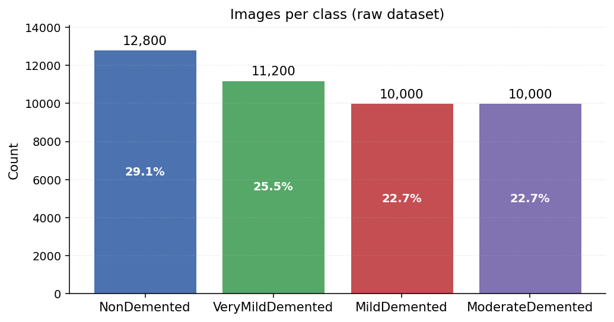

*Figure — images per class in the raw dataset.*
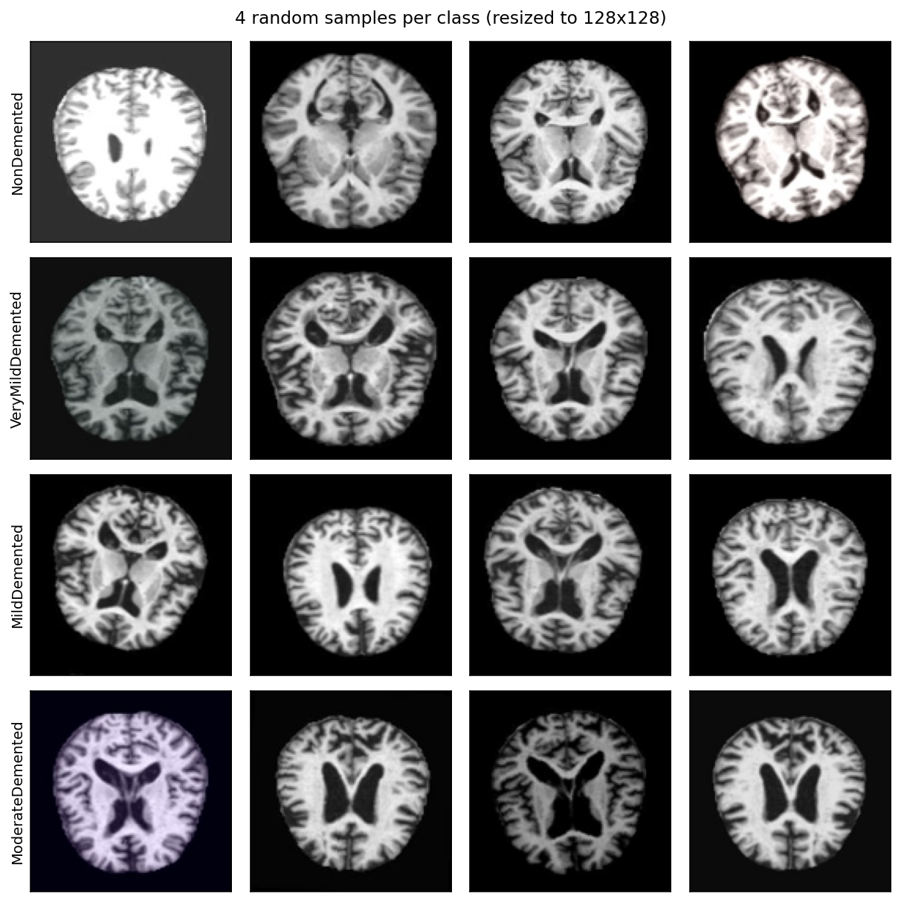

*Figure — 8 random samples per class, resized to 128x128.*

## 3. Data Preprocessing

All images are decoded with PIL, forced to 3 channels (mixed grayscale / RGB sources are unified), resized to **128×128**, and normalized to **float32 in [0, 1]**.

The dataset is split with stratified sampling: **70 % train / 15 % val / 15 % test**, deterministic at SEED = 42. The splits are saved to `outputs/splits/{train,val,test}.csv` (using *relative* paths so the same CSV works on Windows and on Colab).

Per-split totals:

| Split | Total | NonDemented | VeryMildDemented | MildDemented | ModerateDemented |
|---|---:|---:|---:|---:|---:|
| train | 30,799 | 8,959 | 7,840 | 7,000 | 7,000 |
| val | 6,600 | 1,920 | 1,680 | 1,500 | 1,500 |
| test | 6,601 | 1,921 | 1,680 | 1,500 | 1,500 |

Stratification keeps each class's share within ~0.01 across train/val/test.

**Augmentation policy** (training only): `RandomRotation(0.03)` (≈±10.8°), `RandomTranslation(0.05, 0.05)` (≈±5%), `RandomZoom(0.05)` (≈±5%). Horizontal flips are deliberately omitted because MRI left/right asymmetry can carry information.

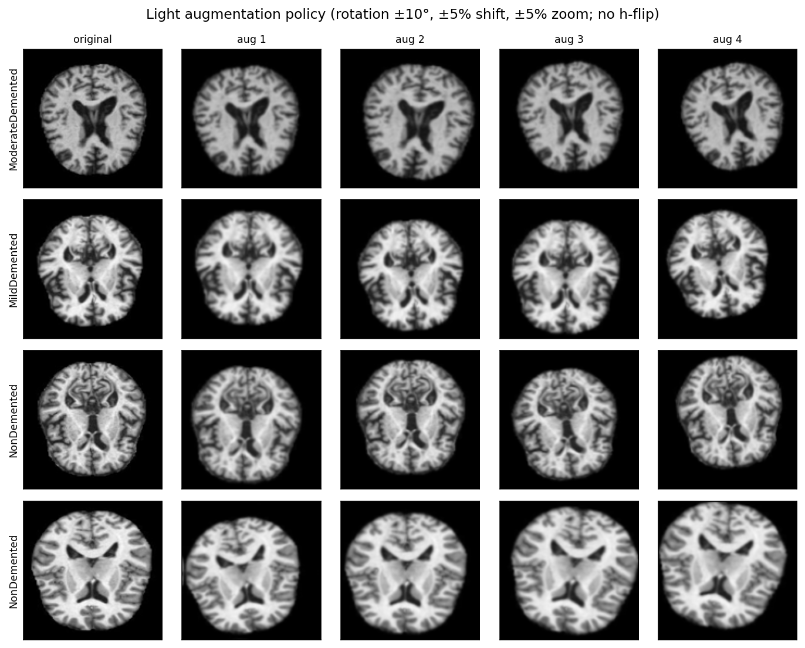

*Figure — original (left) vs four augmented variants per row.*

## 4. Model A — Custom CNN (from scratch)

Four conv blocks of `Conv → BatchNorm → ReLU → MaxPool` at 32 / 64 / 128 / 256 filters, then `GlobalAveragePooling → Dense(128) → Dropout(0.3) → Dense(4, softmax)`. Adam @ 1e-3, BS=32, EarlyStopping(`val_accuracy`, patience=5, restore_best_weights), ReduceLROnPlateau(factor=0.5, patience=2). 423 K trainable parameters.

**Headline metrics on the held-out test set:**

- Accuracy: **0.9053**
- Macro precision / recall / F1: 0.9104 / 0.9080 / **0.9084**
- Weighted F1: 0.9047
- Test set size: 6,601
- Epochs run: 30, wall-clock: 11652.21 s

**Per-class scores:**

| Class | Precision | Recall | F1 |
|---|---:|---:|---:|
| NonDemented | 0.8569 | 0.9193 | 0.8870 |
| VeryMildDemented | 0.8598 | 0.7845 | 0.8204 |
| MildDemented | 0.9250 | 0.9460 | 0.9354 |
| ModerateDemented | 1.0000 | 0.9820 | 0.9909 |

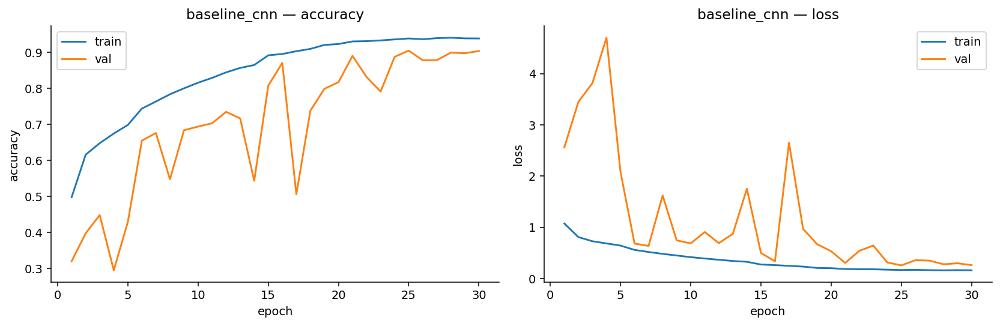

*Figure — baseline_cnn training/validation curves.*
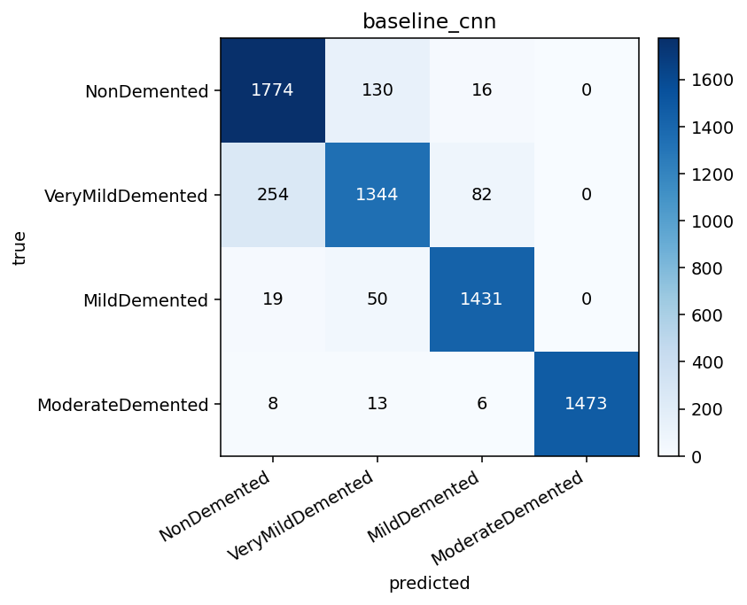

*Figure — baseline_cnn confusion matrix (counts).*

## 5. Model B — MobileNetV2 (transfer learning)

MobileNetV2 ImageNet backbone (`include_top=False`) with a `Rescaling(scale=2, offset=-1)` preprocessing layer (saves cleanly to `.keras`), GAP, Dropout(0.3), Dense(4, softmax). Two-stage training: stage 1 freezes the backbone (≈5 K trainable head params, lr=1e-3); stage 2 fine-tunes the top 20 layers (≈1.21 M trainable, lr=1e-5). The notebook compares the two stages' best `val_accuracy` and persists whichever weights wins.

**Headline metrics on the held-out test set:**

- Accuracy: **0.7426**
- Macro precision / recall / F1: 0.7511 / 0.7467 / **0.7430**
- Weighted F1: 0.7375
- Test set size: 6,601
- Epochs run: 20, wall-clock: 6680.1 s

**Per-class scores:**

| Class | Precision | Recall | F1 |
|---|---:|---:|---:|
| NonDemented | 0.6894 | 0.7996 | 0.7404 |
| VeryMildDemented | 0.6527 | 0.4720 | 0.5478 |
| MildDemented | 0.6764 | 0.7873 | 0.7277 |
| ModerateDemented | 0.9858 | 0.9280 | 0.9560 |

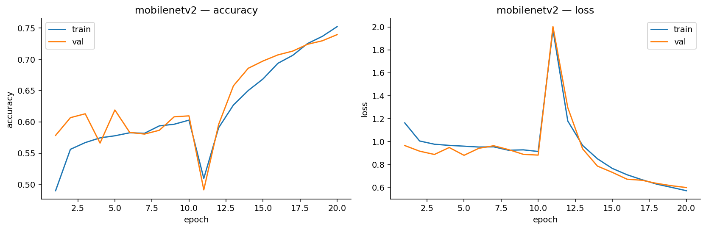

*Figure — mobilenetv2 training/validation curves.*

*Figure — mobilenetv2 confusion matrix (counts).*

## 6. Model C — VGG16 (transfer learning)

VGG16 ImageNet backbone with `Rescaling(255)` then `vgg16.preprocess_input` applied directly on the symbolic tensor (no Lambda, save-safe), GAP, Dense(256), Dropout(0.5), Dense(4, softmax). 14.85 M total params; 132 K trainable in stage 1. Fine-tuning of the last conv block is supported via a flag but disabled by default — the project plan flags VGG16 fine-tuning as risky.

**Headline metrics on the held-out test set:**

- Accuracy: **0.7290**
- Macro precision / recall / F1: 0.7391 / 0.7332 / **0.7348**
- Weighted F1: 0.7287
- Test set size: 6,601
- Epochs run: 15, wall-clock: 4258.22 s

**Per-class scores:**

| Class | Precision | Recall | F1 |
|---|---:|---:|---:|
| NonDemented | 0.6779 | 0.7538 | 0.7138 |
| VeryMildDemented | 0.5956 | 0.5304 | 0.5611 |
| MildDemented | 0.7001 | 0.7347 | 0.7170 |
| ModerateDemented | 0.9828 | 0.9140 | 0.9472 |

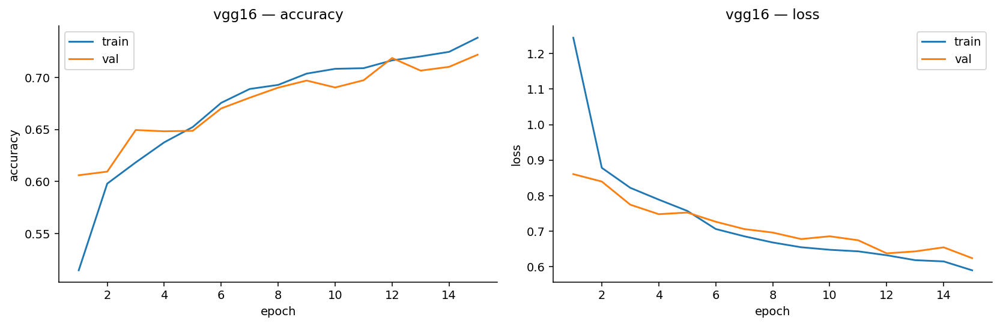

*Figure — vgg16 training/validation curves.*
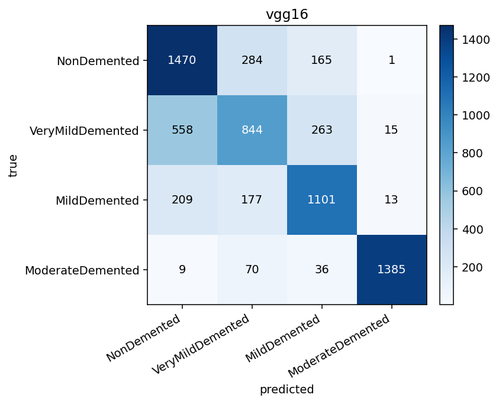

*Figure — vgg16 confusion matrix (counts).*

## 7. Comparison

| model        |   accuracy |   macro_precision |   macro_recall |   macro_f1 |   weighted_f1 |   epochs_run |   elapsed_seconds |   n_test |
|:-------------|-----------:|------------------:|---------------:|-----------:|--------------:|-------------:|------------------:|---------:|
| baseline_cnn |     0.9053 |            0.9104 |         0.908  |     0.9084 |        0.9047 |           30 |          11652.2  |     6601 |
| mobilenetv2  |     0.7426 |            0.7511 |         0.7467 |     0.743  |        0.7375 |           20 |           6680.1  |     6601 |
| vgg16        |     0.729  |            0.7391 |         0.7332 |     0.7348 |        0.7287 |           15 |           4258.22 |     6601 |

**Per-class F1, head-to-head:**

| class            |   baseline_cnn |   mobilenetv2 |   vgg16 |
|:-----------------|---------------:|--------------:|--------:|
| MildDemented     |         0.9354 |        0.7277 |  0.717  |
| ModerateDemented |         0.9909 |        0.956  |  0.9472 |
| NonDemented      |         0.887  |        0.7404 |  0.7138 |
| VeryMildDemented |         0.8204 |        0.5478 |  0.5611 |

**Where each model is most confused** (largest off-diagonal in the normalized confusion matrix):

- **baseline_cnn** — confuses **VeryMildDemented -> NonDemented** 16.1% of VeryMildDemented samples.
- **mobilenetv2** — confuses **VeryMildDemented -> NonDemented** 32.4% of VeryMildDemented samples.
- **vgg16** — confuses **VeryMildDemented -> NonDemented** 29.8% of VeryMildDemented samples.

Best test accuracy: **baseline_cnn** (0.9053). Best macro F1: **baseline_cnn** (0.9084).

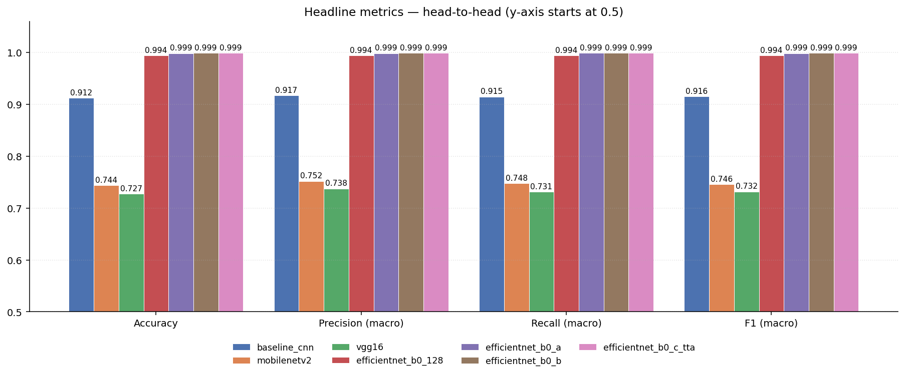

*Figure — headline metrics — head-to-head bar chart.*
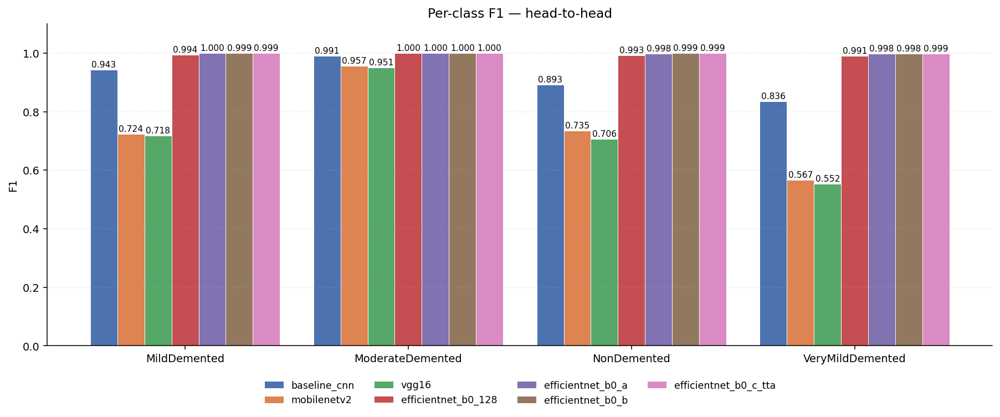

*Figure — per-class F1 — head-to-head.*
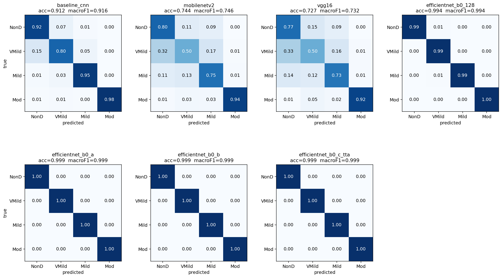

*Figure — side-by-side normalized confusion matrices.*

## 8. Explainability — Grad-CAM

Grad-CAM produces a class-discriminative localization map by weighting the activations of the last conv layer with the gradients of the predicted class score. Applied to each trained model below; we show 2 correctly classified and 2 incorrectly classified examples per model, picked stratified by true class so the panel covers more than one severity level when possible.

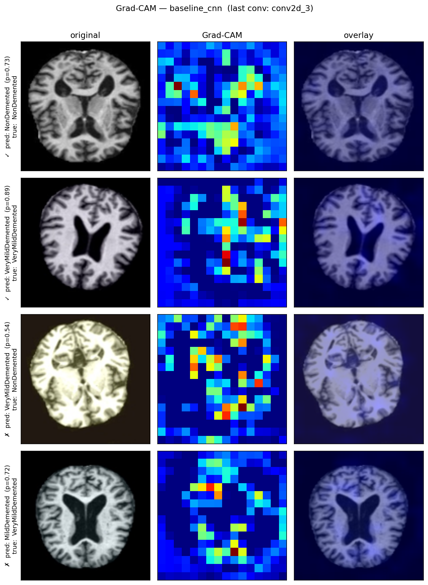

*Figure — Grad-CAM heatmaps for baseline_cnn — original / heatmap / overlay per row.*
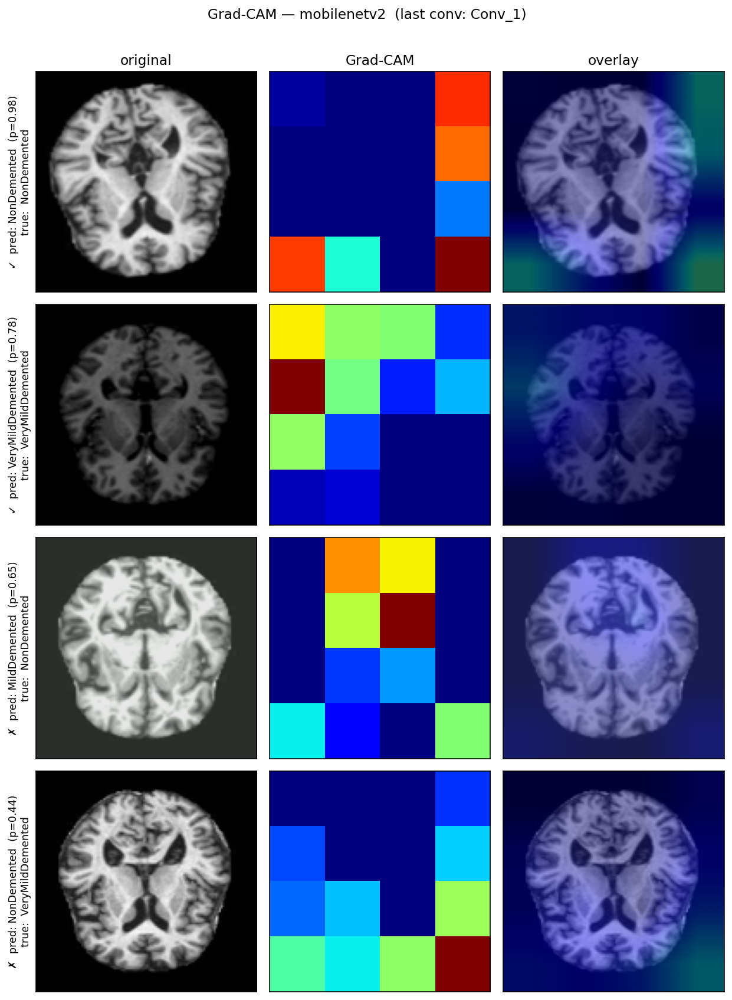

*Figure — Grad-CAM heatmaps for mobilenetv2 — original / heatmap / overlay per row.*
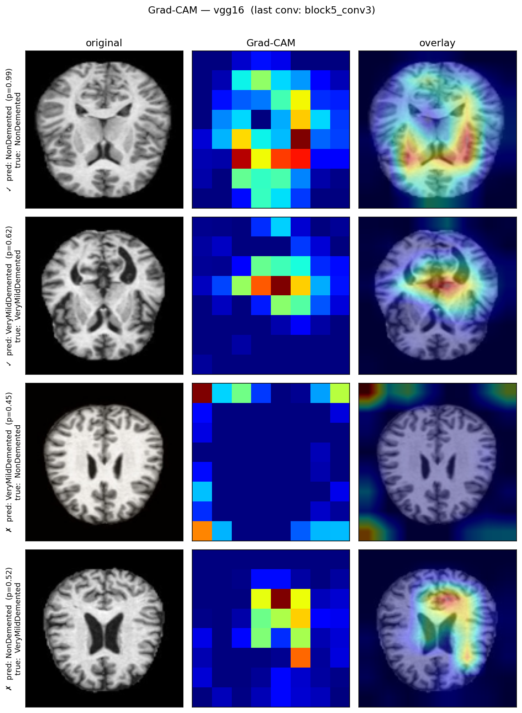

*Figure — Grad-CAM heatmaps for vgg16 — original / heatmap / overlay per row.*

## 9. Discussion and Limitations

**The dataset is augmented and upsampled.** The Kaggle dataset description explicitly states that the images have already been augmented and upsampled. Together with image-level random splitting (we cannot do patient-level splitting because the dataset does not expose patient or scan IDs), this creates a real risk that very similar images leak across train / val / test. The reported numbers are therefore *upper bounds* on what these models would achieve in a clinical evaluation.

**Inputs are 2D JPGs, not 3D MRI volumes.** The models classify pre-processed 2D slices, which loses through-plane structure available in raw NIfTI / DICOM volumes. A more rigorous pipeline would operate on full 3D volumes with patient-level splits.

**Macro F1 is the right headline metric here.** With a 28% / 25% / 23% / 23% class distribution, accuracy alone is misleading — a model that always predicts NonDemented can already score ~28% accuracy with macro F1 ≈ 0.11. Macro F1 (and per-class F1) are reported alongside accuracy.

**Therefore, this project is best interpreted as a benchmark comparison between architectures, not as a clinical diagnostic system.**

**Other limitations / caveats.**

- Native Windows TF stopped supporting GPU after TF 2.10; the local RTX 5080   (Blackwell, sm_120) cannot use those old wheels. Full training runs on   Google Colab GPU; the notebooks include a `SMOKE` toggle that auto-degrades   to a 2-epoch run on 2% of the data when no GPU is visible.
- Grad-CAM is a correlative explanation. It says where the model is looking,   not whether what it is looking at is clinically informative.
- The `tf.data` pipeline uses `reshuffle_each_iteration=True` and AUTOTUNE   parallel mapping, so per-epoch training order is not bit-identical across   machines even at SEED=42; the splits themselves *are* deterministic.

## 10. Reproducibility checklist

- All splits saved as CSVs at `outputs/splits/`.
- All best weights saved at `outputs/models/<model>.keras`.
- All test predictions saved at `outputs/predictions/<model>_test_predictions.npz`   with `y_true`, `y_pred`, `y_proba`, and per-row `relpaths`.
- All metrics saved as JSON at `outputs/predictions/<model>_metrics.json`.
- Per-step Markdown reports at `outputs/reports/`.
- This final report is fully regenerated from those artifacts by   `python -m src.final_report` — no model loading or retraining required.
