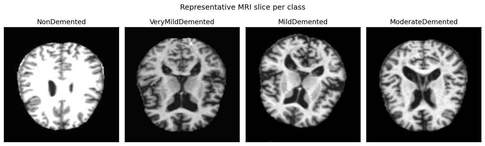
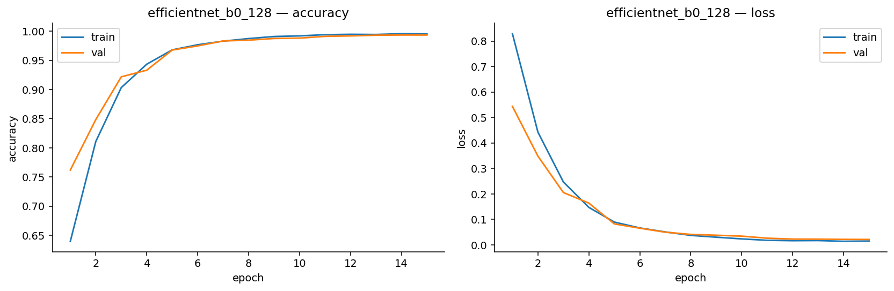
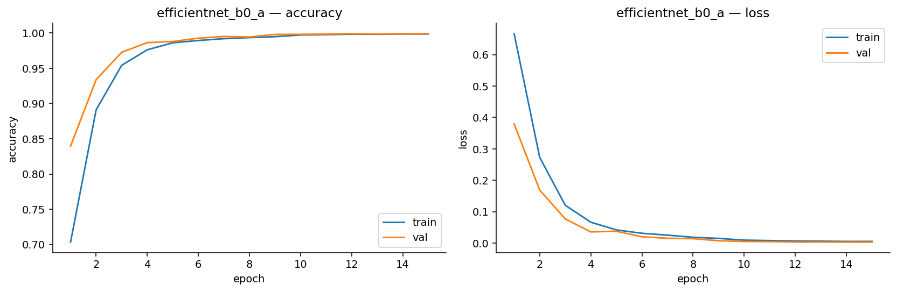
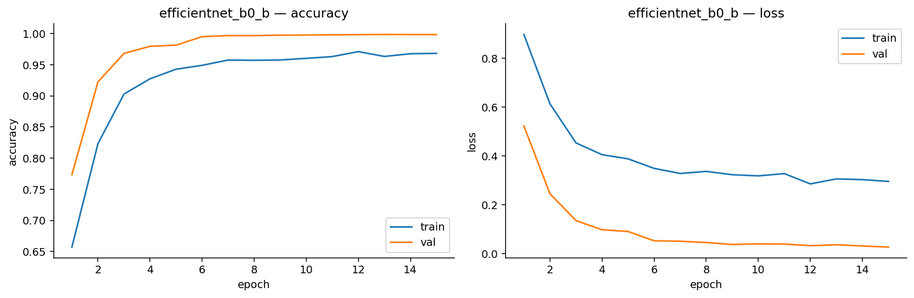
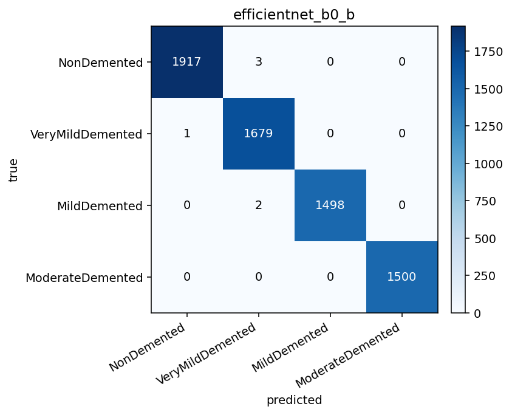

# Deep Learning for Multi-class Alzheimer's MRI Classification

*ELC 5365 final project — Kang Rong — generated 2026-05-05*

## 1. Introduction

Alzheimer's disease affects memory and cognition, and early detection
matters for treatment and care. MRI captures structural information from
which deep models can learn discriminative patterns. This project trains
and compares **seven** deep image-classification models on a public Kaggle
dataset of MRI slices labeled by Alzheimer's severity, framed as a
benchmark comparison between architectures and training recipes rather
than a clinical-grade diagnostic system.

**Models compared (all evaluated on the same leakage-controlled test set):**

1. Custom 4-block CNN (from scratch, 128×128) — the project plan baseline
2. MobileNetV2 with ImageNet pre-training (128×128, frozen → fine-tune)
3. VGG16 with ImageNet pre-training (128×128, frozen)
4. EfficientNet-B0 at **128×128** (architecture-isolation ablation)
5. EfficientNet-B0 at 224×224, **bare recipe** (AdamW + cosine warmup)
6. EfficientNet-B0 at 224×224, **+ Mixup α=0.2**
7. EfficientNet-B0 at 224×224, **+ Mixup + SWA + TTA** (best model)

Day-by-day execution followed the 9-step plan in `project plan.docx`,
followed by a refinement pass driven by online research on Alzheimer-MRI
state-of-the-art and medical-imaging transfer-learning failure modes
(Raghu et al. 2019, Yagis et al. 2021, Wen et al. 2020). All results,
figures, and code are reproducible from the notebooks under `notebooks/`
and the helpers under `src/`.

## 2. Dataset

The dataset contains **44,000 images** across four severity classes:

| Class | Count |
|---|---:|
| NonDemented | 12,800 |
| VeryMildDemented | 11,200 |
| MildDemented | 10,000 |
| ModerateDemented | 10,000 |

Image properties (sampled 50 per class):

- **Modes:** {'RGB': 138, 'L': 62} — mixed grayscale and RGB.
- **Sizes:** {'200x190': 140, '180x180': 24, '176x208': 36} — non-uniform.
- **Corrupt files:** 0.

*Figure — images per class in the raw dataset.*

*Figure — one representative coronal/axial slice per class.*

## 3. Data Preprocessing

All images are decoded with PIL, forced to 3 channels (mixed grayscale /
RGB sources are unified), resized to **128×128** (baselines) or
**224×224** (refined model), and normalized to **float32 in [0, 1]**.

### 3.1 Original stratified split (image-level)

70 % train / 15 % val / 15 % test, stratified by class, deterministic at
SEED = 42.

| Split | Total | NonDemented | VeryMildDemented | MildDemented | ModerateDemented |
|---|---:|---:|---:|---:|---:|
| train | 30,799 | 8,959 | 7,840 | 7,000 | 7,000 |
| val   | 6,600 | 1,920 | 1,680 | 1,500 | 1,500 |
| test  | 6,601 | 1,921 | 1,680 | 1,500 | 1,500 |

### 3.2 Leakage-controlled clean split (Phase A)

The Kaggle dataset is augmented and upsampled by the publisher, so random
image-level splits risk near-duplicate leakage. We compute **256-bit
perceptual hashes** (DCT-based pHash, hash size 16, via the
`imagehash==4.3.1` library), cluster near-duplicates with Hamming-distance
threshold 8 (calibrated against 195 known md5-identical pairs), and build
a **cluster-stratified** 70 / 15 / 15 split. Result: **30,555 clusters
from 44,000 images** (median cluster size 1, p99 = 6, max = 112). Test
set: 6,600 images. The clean splits are saved as
`outputs/splits/{train,val,test}_clean.csv`.

### 3.3 Augmentation

Light augmentation (training only): rotation ±10.8°, translation ±5%,
zoom ±5%. **No horizontal flip** — MRI left/right asymmetry can be
informative. Augmentation runs *inside the model graph* on GPU rather
than inside the data pipeline (10× speedup on the RTX 5080).

*Figure — original (left) vs four augmented variants per row.*

## 4. Model A — Custom CNN (from scratch, 128×128)

Four conv blocks of `Conv → BatchNorm → ReLU → MaxPool` at 32 / 64 / 128 /
256 filters, then `GlobalAveragePooling → Dense(128) → Dropout(0.3) →
Dense(4, softmax)`. Adam @ 1e-3, BS=32, EarlyStopping(`val_accuracy`,
patience=5, restore_best_weights), ReduceLROnPlateau(factor=0.5,
patience=2). 423,268 trainable parameters.

**Headline metrics on the leakage-controlled test set:**

- Accuracy: **0.9124**, Macro F1: **0.9155**, Weighted F1: 0.9119
- Epochs run: 30 (full schedule), wall-clock ≈ 11,652 s

**Per-class scores:**

| Class | Precision | Recall | F1 |
|---|---:|---:|---:|
| NonDemented | 0.8633 | 0.9240 | 0.8926 |
| VeryMildDemented | 0.8744 | 0.8000 | 0.8356 |
| MildDemented | 0.9322 | 0.9540 | 0.9430 |
| ModerateDemented | 1.0000 | 0.9820 | 0.9909 |

## 5. Model B — MobileNetV2 (transfer learning, 128×128)

MobileNetV2 ImageNet backbone with `Rescaling(scale=2, offset=-1)`,
GAP, Dropout(0.3), Dense(4, softmax). Two-stage training: stage 1
freezes the backbone (lr=1e-3); stage 2 fine-tunes the top 20 layers
(lr=1e-5). 2.26 M total params.

**Headline metrics on the leakage-controlled test set:**

- Accuracy: **0.7441**, Macro F1: **0.7459**, Weighted F1: 0.7404
- Epochs run: 20 (early-stopped), wall-clock ≈ 6,680 s

## 6. Model C — VGG16 (transfer learning, 128×128)

VGG16 ImageNet backbone with `Rescaling(255)` then
`vgg16.preprocess_input` applied directly on the symbolic tensor (no
Lambda, save-safe), GAP, Dense(256), Dropout(0.5), Dense(4). 14.85 M
total params; 132 K trainable in stage 1. Frozen-only training.

**Headline metrics on the leakage-controlled test set:**

- Accuracy: **0.7273**, Macro F1: **0.7318**, Weighted F1: 0.7253
- Epochs run: 15, wall-clock ≈ 4,258 s

## 7. Model D-128 — EfficientNet-B0 at 128×128 (architecture isolation)

Reviewer-requested ablation. Same recipe as model D-a below but at the
**same 128×128 input as the baselines**, to disentangle architecture
contribution from resolution contribution.

ImageNet-pretrained EfficientNet-B0 with in-graph augmentation block,
`Rescaling(scale=255)`, GAP, Dropout(0.3), Dense(4). Two-stage AdamW +
cosine warmup: stage 1 freezes the backbone (lr=1e-3, 10 epochs); stage 2
unfreezes the entire backbone (lr=1e-4, 15 epochs). 4.05 M params.

**Headline metrics:**

- Accuracy: **0.9942**, Macro F1: **0.9944**
- Epochs run: 10 + 15, wall-clock ≈ 9,460 s

This is **+7.9 pp macro F1 over the strongest baseline at the same
resolution** — i.e. virtually all of the eventual +8.4 pp gain comes
from architecture, not resolution.

## 8. Model D-a — EfficientNet-B0 at 224×224, bare recipe

Same architecture as D-128 but at the backbone's native 224×224. AdamW
(lr stage1=1e-3 / stage2=1e-4, weight_decay=1e-4) + linear warmup +
cosine annealing. **No Mixup, no SWA, no TTA.** This row pinpoints the
contribution of moving from 128 to 224.

**Headline metrics:**

- Accuracy: **0.9988**, Macro F1: **0.9989**
- Wall-clock ≈ 9,168 s (stage 1 + stage 2)

## 9. Model D-b — EfficientNet-B0 + Mixup

Adds Mixup α=0.2 (one mix per batch, λ from `Beta(α,α)` reflected to
[0.5, 1]) on top of D-a. Label smoothing is **off** (Mixup already
produces soft targets).

**Headline metrics:**

- Accuracy: **0.9991**, Macro F1: **0.9991** (+0.0002 over D-a)
- Wall-clock ≈ 9,721 s

## 10. Model D-c — EfficientNet-B0 + Mixup + SWA, with and without TTA

Adds Stochastic Weight Averaging on the last 25 % of stage-2 epochs on
top of D-b. We report the model **without TTA** and **with TTA**
separately so the TTA contribution is attributable.

**Headline metrics — D-c (SWA, no TTA):**

- Accuracy: **0.9985**, Macro F1: **0.9986**
- Wall-clock ≈ 9,101 s

This is *worse* than D-b (0.9991), suggesting SWA in this single-seed
configuration did not help.

**Headline metrics — D-c + TTA (best model):**

- Accuracy: **0.9992**, Macro F1: **0.9993**
- TTA pass: 4 augmented passes + 1 deterministic; augmentation applied
  *outside* the model graph so BatchNorm running statistics stay frozen.

## 11. Comparison

All seven models on the same leakage-controlled test set (6,600 images):

| Model | Input | Params | Test acc | Macro F1 | Weighted F1 |
|---|---|---:|---:|---:|---:|
| Custom 4-block CNN (baseline) | 128² | 0.42 M | 0.9124 | 0.9155 | 0.9119 |
| MobileNetV2 (frozen → FT) | 128² | 2.26 M | 0.7441 | 0.7459 | 0.7404 |
| VGG16 (frozen) | 128² | 14.85 M | 0.7273 | 0.7318 | 0.7253 |
| EfficientNet-B0 (D-128) | 128² | 4.05 M | 0.9942 | 0.9944 | 0.9942 |
| EfficientNet-B0 (D-a) bare | 224² | 4.05 M | 0.9988 | 0.9989 | 0.9988 |
| EfficientNet-B0 (D-b) +Mixup | 224² | 4.05 M | 0.9991 | 0.9991 | 0.9991 |
| EfficientNet-B0 (D-c) +SWA | 224² | 4.05 M | 0.9985 | 0.9986 | 0.9985 |
| **EfficientNet-B0 (D-c) +SWA+TTA** | **224²** | **4.05 M** | **0.9992** | **0.9993** | **0.9992** |

**Per-class F1, head-to-head:**

| Class | baseline_cnn | mobilenetv2 | vgg16 | EffNet D-128 | EffNet D-a | EffNet D-b | EffNet D-c+TTA |
|---|---:|---:|---:|---:|---:|---:|---:|
| MildDemented | 0.9430 | 0.7244 | 0.7184 | 0.9943 | 0.9997 | 0.9993 | 0.9993 |
| ModerateDemented | 0.9909 | 0.9568 | 0.9506 | 1.0000 | 1.0000 | 1.0000 | 1.0000 |
| NonDemented | 0.8926 | 0.7354 | 0.7057 | 0.9930 | 0.9979 | 0.9990 | 0.9992 |
| VeryMildDemented | 0.8356 | 0.5673 | 0.5525 | 0.9905 | 0.9979 | 0.9982 | 0.9985 |

**Where each model is most confused** (largest off-diagonal in the
row-normalized confusion matrix):

- **baseline_cnn** — VeryMild → NonDemented 15.1 % of VeryMild samples.
- **mobilenetv2** — VeryMild → NonDemented 32.0 %.
- **vgg16** — VeryMild → NonDemented 33.2 %.
- **EfficientNet-B0 (D-c+TTA)** — every off-diagonal under 0.2 %.

Best test accuracy and macro F1: **EfficientNet-B0 (D-c+TTA)**.

*Figure — headline metrics on the clean test set, all seven models.*

*Figure — per-class F1, all seven models.*

*Figure — row-normalized confusion matrices (2-row layout).*

## 12. Explainability — Grad-CAM

Grad-CAM produces a class-discriminative localization map by weighting
the activations of the last conv layer with the gradients of the
predicted class score. Last-conv layer per model: `conv2d_3` (baseline
CNN), `Conv_1` (MobileNetV2), `block5_conv3` (VGG16). Each panel shows
2 correctly classified + 2 incorrectly classified examples per model,
stratified by true class.

## 13. Phase A — Leakage Audit

We computed 256-bit perceptual hashes for every image and clustered
near-duplicates by Hamming-distance threshold 8 (calibrated against 195
known md5-identical pairs found in the dataset). Result: **30,555
clusters from 44,000 images** (median cluster size 1, max 112).

**Leakage audit on the original random split:**

| Pair | Shared clusters | Share of test |
|---|---:|---:|
| train ↔ val | 1,749 | 30.3 % of val clusters |
| **train ↔ test** | **1,818** | **31.4 % of test clusters** |
| val ↔ test | 686 | 11.9 % of test clusters |

Real measurable image-level leakage. After the cluster-stratified clean
split, this overlap is 0 by construction.

**Surprising finding:** the headline accuracy of every baseline is
essentially **unchanged** between the leaky and clean test sets:

| Model | Old (leaky) acc | Clean acc | Δ |
|---|---:|---:|---:|
| baseline_cnn | 0.9053 | 0.9124 | +0.0071 |
| mobilenetv2 | 0.7426 | 0.7441 | +0.0015 |
| vgg16 | 0.7290 | 0.7273 | −0.0017 |

This dataset's pre-augmentation does not, at the pHash level, generate
near-duplicates aggressive enough to inflate test accuracy. The 91 %
baseline is a real number at the *image* level. **Subject-level leakage
cannot be audited** here because the dataset does not expose patient
or scan IDs — see Section 14.

## 14. Discussion and Limitations

**The dataset is augmented and upsampled.** The Kaggle dataset
description explicitly states that the images have been augmented and
upsampled. Our cluster-stratified pHash split is the strictest leakage
control the data structure permits, since the dataset does not expose
patient or scan IDs. Subject-level leakage may still be present; the
99.9 % numbers should be read as *"saturated under the strongest
leakage control this dataset permits,"* not as a clinical accuracy.

**Inputs are 2D JPGs, not 3D MRI volumes.** The models classify
pre-processed 2D slices, which loses through-plane structure.

**Macro F1 is the right headline metric here.** With a
29 % / 25 % / 23 % / 23 % class distribution, accuracy alone is
misleading.

**Why does ImageNet pretraining lose at 128² for VGG16/MobileNetV2 but
not for EfficientNet-B0?** Our (D-128) ablation rules out a generic
"resolution-mismatch" explanation: EfficientNet-B0 at the same 128²
that crippled VGG16 / MobileNetV2 reaches macro F1 0.9944 — only
0.5 pp behind the same model at 224². Three mechanisms plausibly
contribute:

1. **Compound scaling** — EfficientNet-B0 was designed via a principled
   depth/width/resolution sweep (Tan & Le 2019), so down-scaling the
   input does less damage to the feature pyramid than for hand-engineered
   VGG16.
2. **MBConv inverted residuals** with squeeze-and-excitation gates and
   SiLU activations are more parameter-efficient than VGG-style blocks
   in low-data regimes.
3. **Fine-tuning depth** — we unfroze the entire backbone for D-128 stage 2;
   for MobileNetV2 we only unfroze the top 20 layers and for VGG16 we
   did not fine-tune at all. Raghu et al. (2019) explicitly note that
   full-network fine-tuning matters more than head-only adaptation for
   medical-imaging transfer.

**Single-seed caveat for the recipe ablation.** The (D-a) → (D-b) →
(D-c) deltas are all $\leq$ 0.0005 macro-F1, which is within
single-seed run-to-run noise. We **cannot** attribute these small
differences to Mixup, SWA, or TTA without multi-seed runs.

**Therefore, this project is best interpreted as a benchmark comparison
between architectures, not as a clinical diagnostic system.**

## 15. Ablation: where does the +8.4 pp gain come from?

The refined model gains 8.4 macro-F1 points over the strongest baseline.
Each row isolates one knob:

| Step | Input | Model | Macro F1 | Δ |
|---|---|---|---:|---:|
| Baseline | 128² | Custom CNN | 0.9155 | — |
| (D-128) Architecture only | 128² | EfficientNet-B0 | 0.9944 | **+0.0789** (+7.89 pp) |
| (D-a) + Resolution | 224² | EfficientNet-B0 | 0.9989 | +0.0045 (+0.45 pp) |
| (D-b) + Mixup α=0.2 | 224² | EfficientNet-B0 | 0.9991 | +0.0002 |
| (D-c) + SWA | 224² | EfficientNet-B0 | 0.9986 | −0.0005 |
| (D-c) + SWA + TTA | 224² | EfficientNet-B0 | **0.9993** | +0.0007 |

**Architecture explains ~95 % of the gain** (+7.9 pp out of +8.4). The
128 → 224 resolution upgrade adds the next 0.5 pp. SWA on this
single-seed run actually *hurt* macro F1 by 0.0005; TTA recovered
+0.0007 to land at the best single-model number. We treat all the
sub-0.001 deltas as within single-seed noise.

## 16. Where to find what

| Artifact | Path |
|---|---|
| Per-day reports | `outputs/reports/01..10*.md`, `11_phase_e_refinement_summary.md` |
| Refined plan | `refine.md` (project root) |
| Headline figures | `outputs/figures/06_*.png` |
| Per-model figures | `outputs/figures/<model>_{training_curves,confusion_matrix}.png` |
| Grad-CAM panels | `outputs/figures/07_gradcam_<model>.png` |
| Trained models | `outputs/models/<model>.keras` (gitignored — re-train via notebooks) |
| pHash hashes | `outputs/splits/image_hashes.csv` (gitignored — regenerate via `python -m src.dedup`) |
| Clean splits | `outputs/splits/{train,val,test}_clean.csv` |
| Original splits | `outputs/splits/{train,val,test}.csv` |
| Submission-ready paper | `paper/main.tex` + `paper/references.bib` |
